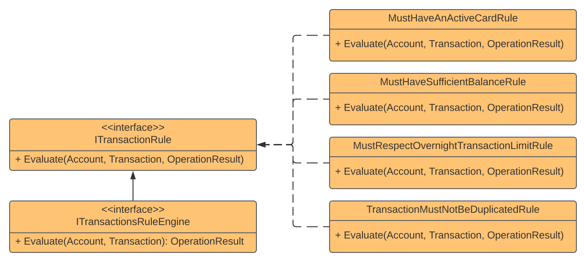

## Rules Engine

### Definition
A **behavioral design pattern** that lets you to define a series of conditional rules to be evaluated over a context. The **Rules Engine** pattern is a good implementation example of the **Open/Closed Principle (OCP)**, from **SOLID**, since you can add new rules without touching existing one's. Other principle that **Rules Engine** helps us to follow is the **Single Responsibility Principle (SRP)** because each rule is only responsible to evaluate itself.

### Uses Cases
- Multiple conditions to be evaluated over a context.

### Specification
- The Specification pattern is similar to the Rules Engine, principally the validation side of the pattern.  

### Implementation Use Case
The solution proposes an service to validate a series of rules before to perform a financial transaction.

#### The main rules are
- The Account must have an active Card
- The Account must have sufficient balance for transaction
- The transaction must respect an overnight transaction value limit
- The transaction must not be duplicated

The **Engine** itself acts as an **Orchestrator**. Is responsible for create a instance of **Operation Result**, inject all rules, apply then to the context that must be evaluated, and return result.

### Next Steps
- If necessary rules order can be handled in **Dependency Injection** configuration
- **Aggregated rules** can be evaluated together
- Short Circuit rules can be added and handled on engine to avoid extra validation on **Fail-Fast** approaches

### Operation Result
To simplify validation I've used the **Operation Result Pattern** where each rule add a validation on **Operation Result** instance if the rule was violated. If necessary, this can be replaced with the **Domain Validation Pattern** using dependency injection to follow **Referential Transparency**.

### Pattern Diagram

