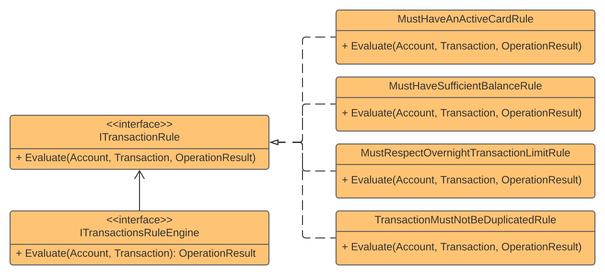

## Rules Engine

### Definition
The **Rules Engine** is a **behavioral** design pattern that lets you define a series of conditional rules to evaluate over a context.

### Real-World Uses Cases
- Evaluate a series of conditions over a context

### Challenge
Create a service to evaluate a series of rules before performing a financial transaction.

#### The rules are
1. The Account must have an active card
2. The Account must have a sufficient balance for the transaction
3. The transaction must respect an overnight transaction value limit
4. Must not process duplicated transactions

### Solution
1. Extract a contract for rules
2. Define a method to aggregate validation results
3. Implement each rule following the contract specification
4. Create the **Engine** to apply the rules and return the result

### Pattern Diagram

### Extras
- If necessary, you can handle rules order in **Dependency Injection** configuration
- You can aggregate rules and validate then together
- Add short circuit rules to use **Fail-Fast** approaches
- To simplify validation, I've used the **Operation Result Pattern**

