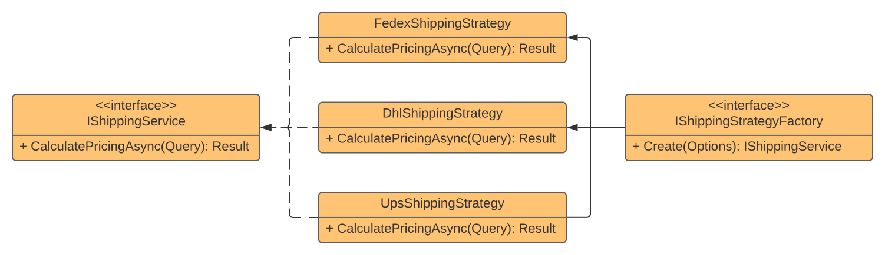

## Strategy

### Definition
A **behavioral design pattern** that lets you select an implementation at runtime based on a specified condition. The **Strategy** pattern is a good implementation example of the **Open/Closed Principle (OCP)** from **SOLID** since you can add new strategies without needing to change existing one's code. Other principle that **Strategy** helps us to follow is the **Single Responsibility Principle (SRP)** because each strategy is responsible only for itself.

### Uses Cases
- Multiple integrations alternatives for the same type of service

### Factory
- To simplify strategy service selection based on input I choose to implement a Factory

### Implementation Use Case
The solution proposes an integration service with three different shipping providers.

Since the integration of this providers is not the main point here, I've only print at console a message for each provider and generate a random number to represent the costs of shipping. The HTTP Client injected at this strategies implementations are only to exemplify how to deal with dependency injection inside the implementations. 

The Factory have a IEnumerable of IStrategy implementations injected and the Create method choose between them based on input parameter.

### Pattern Diagram
