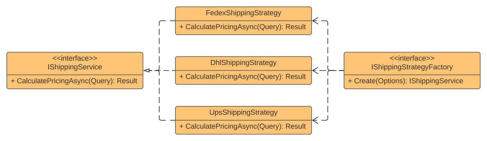

## Strategy

### Definition
The **Strategy** is a **behavioral** design pattern that lets you select an implementation for a contract at runtime based on a specified condition.

### Real-World Uses Cases
- Multiple implementation alternatives for the same type of service

### Challenge
Develop a service that calculates shipping costs from **FEDEX**, **DHL**, or **UPS** providers from a given input.

### Solution
1. Extract a contract between providers
2. Implement each provider following the contract
3. Create a **Factory** to encapsulate the provider creation from parameters

### Components Relationship
