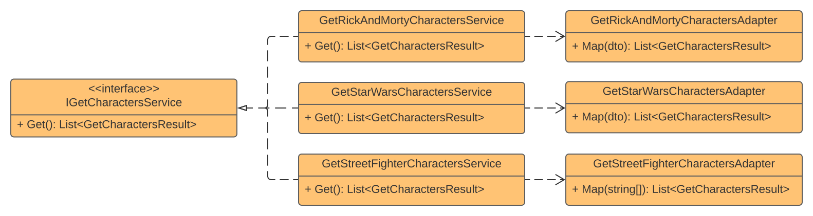

## Adapter

### Definition
The **Adapter** is a **structural** design pattern that allows objects with incompatible interfaces to collaborate. 

### Real-World Uses Cases
- Mapping between contracts

### Challenge
Develop a service that consumes three different providers for game characters. A **REST Endpoint**, a **GraphQL Query**, and a **txt File** on disk. Then merge the provider's return and present result.

### Solution
1. Create a contract for the three providers
2. Implement the providers following the shared _interface_
3. Create an **Adapter** for each provider to map the provider return to contract result
4. Use the adapters into providers
5. Create a service that calls the providers and merge results

### Components Relationship
