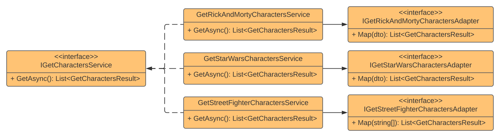

## Adapter

### Definition
A **structural design pattern** that allows objects with incompatible interfaces to collaborate. The **Adapter** pattern is a good implementation example of the **Open/Closed Principle (OCP)** from **SOLID** since you can adapt behaviors without to change existing flow code. Other principle that **Adpter** helps us to follow is the **Single Responsibility Principle (SRP)** because you extract the mapping responsibility from the flow and add to the Adapter that became responsible only to mapping between contracts.

### Uses Cases
- Mapping between contracts
- Mapping between objects from different layers 

### Implementation Use Case
The solution proposes an integration with three different providers for game characters. The first is a **REST Endpoint**, the second is a **GraphQL Query** and the third is a **Txt File** on disk. The main requirement is merge data from the three providers and return as result.

Since there are different providers, with different payloads and consumption methods, I've defined a contract with an **Interface** and a **Result** payload. 

Each provider runs independently on each service that implements the contract. So, there is an **Adapter** to each service to map the result from service dtos to the result defined in the contract. 

### Pattern Diagram
