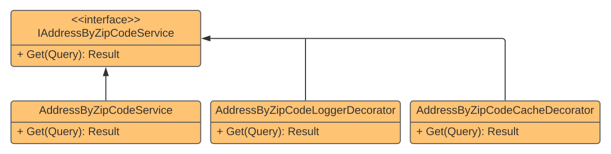

## Decorator

### Definition
A **structural design pattern** used for dynamically adding behavior to a component. The **Decorator** pattern is a good implementation example of the **Open/Closed Principle (OCP)** from **SOLID** since you can extend behavior of an existing flow without needing to change his code. Other principle that **Decorator** helps us to follow is the **Single Responsibility Principle (SRP)** because each decorator is responsible for a single task.

### Uses Cases
- **Crosscutting** concerns like **logging**, **caching**, **authorization**, and more
- Data manipulation going to/from component

### Packages
- [[Scrutor]](https://github.com/khellang/Scrutor) for Dependency Injection
- .NET packages for Memory Cache, Http extensions and Dependency Injection

### Implementation Use Case
The solution proposes an integration service to get address by zipcode. The service itself inject a http client, makes the request, and parse the JSON. 

There is a caching decorator that saves the result in memory for a day and avoid subsequent extra calls for the same zipcode getting the result from memory. 

The last decorator logs query and result. For a simple implementation this decorator only prints data on console.  

### Pattern Diagram

### Execution Flow Diagram
